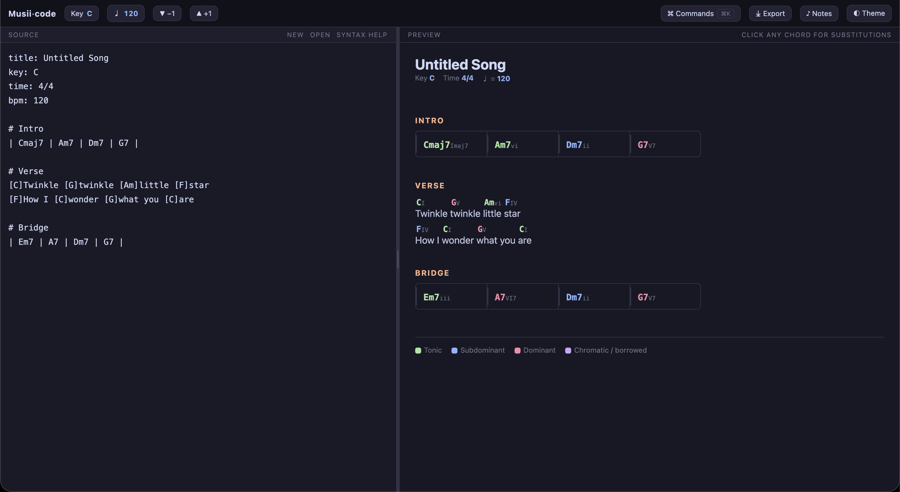
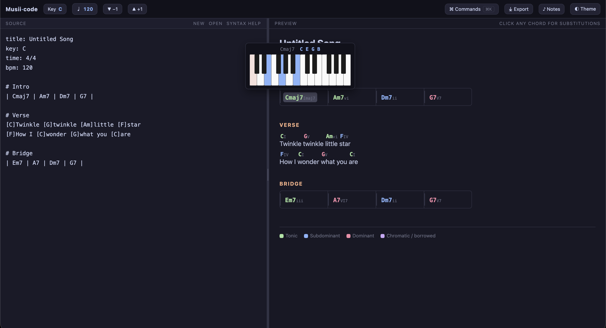
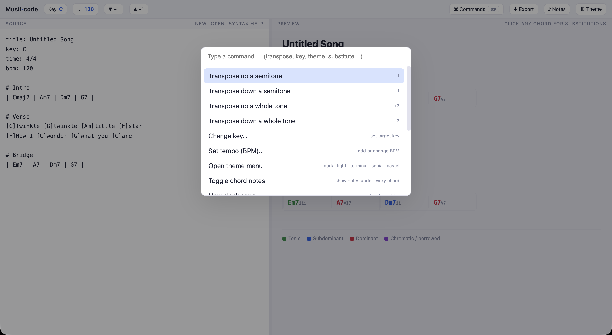
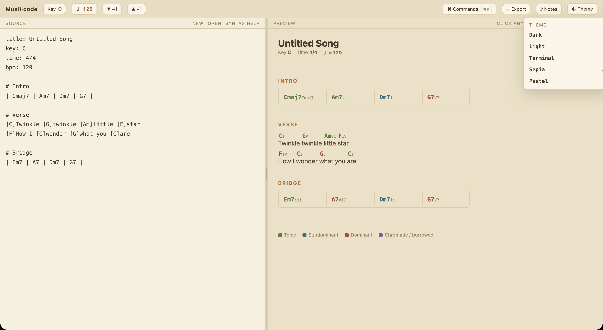

# Musiicode

[](https://ebbanflo.github.io/Musiicode/)
[](./LICENSE)

A music-writing IDE — write chord charts and lead sheets like code, with live harmonic
analysis, chord substitutions, key transposition, piano-shape diagrams, and color coding
by harmonic function.

**▶ Try it live:** <https://ebbanflo.github.io/Musiicode/>

It's a single self-contained `index.html` — no build step, no dependencies, no network
calls. Open it in a browser, or wrap it with [Tauri](https://tauri.app/) for a native
desktop app.

> Status: personal project / work in progress. Used as a reference and writing tool.

## Screenshots

| Editor + live analysis | Substitutions + piano |
|:---:|:---:|
|  |  |
| Command palette (⌘K) | Themes |
|  |  |

## Why I built this

I kept bouncing off the usual songwriting apps. The drag-and-drop ones felt slow and
fiddly, and the ones built around rigid, strictly-structured bars got in my way more than
they helped. What I actually wanted was fast, direct control over how my ideas looked on the
page — to shape the visual representation as quickly as I could think it.

That pull is what led to the core idea behind Musiicode: what if you could *program* your
songwriting? Write the song like code — type chords, Roman numerals, sections, and saved
progressions as plain text — and watch a clean, color-coded chart update live, with the
theory worked out for you, as a bonus.

## Features

- **Text-first editor** with a live preview pane.
- **Chord substitutions** — click any chord for tritone subs, relative major/minor,
  same-function diatonic swaps, secondary dominants, borrowed chords, and extensions.
  Picking one rewrites the source.
- **Next-chord suggestions** — type `>` after a chord to see the most likely next chords
  with percentages (from a built-in common-harmony model).
- **Roman-numeral input** — write `| I | V | vi | IV |` and it renders real chords in the
  current key (transpose-proof); supports qualities/accidentals (`V7`, `ii`, `vii°`, `bVII`).
  Convert a whole song between chords and numerals either direction.
- **Saved progressions** — define `verse = | B | F# |` (or a `[B] [F#]` template); the
  definition is hidden in the preview. Type `@verse` in the editor to expand it inline into
  a `# verse` section plus the saved chords, ready to edit (e.g. type lyrics between them).
- **Reharmonize operator** — append `~` to a chord line to add diatonic 7ths (`~simple`
  strips to triads, `~tritone` swaps dominants); live and non-destructive, or bake it in.
- **Comments** — `//` whole-line or trailing notes that never render.
- **Major & minor key analysis** — Roman numerals and harmonic function for both major
  and minor keys (set `key: Am`, `F#m`, …).
- **Inline key & tempo changes** — write `key:` or `tempo:` again mid-song and it only
  affects the chords below it; the starting key is untouched.
- **Key transposition** — semitone steps or jump to any key, with key-aware sharp/flat
  spelling (slash-chord basses included); multiple key changes transpose together.
- **Color coding** by function — tonic, subdominant, dominant, and chromatic/borrowed.
- **Chord notes + piano diagrams** on hover (and in the substitution menu); a toggle to
  show notes under every chord.
- **Invalid-chord linting** — unrecognized chords are underlined with a count in the header.
- **Tempo (BPM)** and time-signature display.
- **Autosave** to local storage, plus **New / Open / Save** (`.txt` / `.md` / ChordPro).
- **Export** to Markdown or source `.txt`, or print to PDF (preserves the colored sheet).
- **Eight themes** (dark, light, terminal, sepia, pastel, white-on-black, black-on-white,
  and an animated rainbow), a **command palette**, chord **autocomplete**, and a
  **resizable** editor / preview split.

## Quick start

Open `index.html` in any modern browser. That's it. The app opens on a **demo song whose
lyrics explain every feature** — or load it anytime from the command palette
(<kbd>⌘K</kbd> / <kbd>Ctrl+K</kbd> → "Load demo song"). Click **syntax help** in the editor
header for the full reference. (Tip: tap `\` to drop a `|` bar line without Shift.)

## Syntax

```
title: My Song          ← document directives (optional)
key: C
time: 4/4

# Verse                 ← section header

| Cmaj7 Am7 | Dm7 G7 |  ← barred chords, | is a bar line

[C]Twinkle [G]twinkle [Am]little [F]star   ← chords inline above lyrics
```

| You write | It means |
|-----------|----------|
| `key: C` `time: 4/4` `title: …` | document settings |
| `# Name` | a section header |
| `\| Cmaj7 Am7 \| Dm7 G7 \|` | chords grouped into bars |
| `[C]word` | a chord positioned above a lyric |

Chord symbols follow normal lead-sheet notation: `C`, `Am7`, `Gmaj7`, `F#m7b5`, `Bdim7`,
`Csus4`, `D7/F#`, `Eb13`, etc.

## Keyboard / interactions

| Action | How |
|--------|-----|
| Command palette | <kbd>⌘K</kbd> / <kbd>Ctrl+K</kbd> |
| Chord autocomplete | start typing a chord, <kbd>Tab</kbd> to accept |
| See a chord's notes + piano shape | hover the chord in the preview |
| Substitute a chord | click the chord in the preview |
| Transpose | <kbd>▲</kbd>/<kbd>▼</kbd> buttons, or the Key pill |
| Show notes under every chord | **♪ Notes** |
| Export Markdown / PDF | **⤓ Export** |
| Resize panes | drag the divider; double-click to reset |

## Tech

Plain HTML, CSS, and vanilla JavaScript in one file. The music-theory engine (chord
parsing, transposition, Roman-numeral analysis, substitutions, and note spelling) is
self-contained and has no runtime dependencies.

## Roadmap

- Guitar chord diagrams (fretboard shapes)
- Chord inversions / voicing display
- Beat-accurate chord placement within bars
- Nashville-number view
- Altered-dominant (`alt`) chord parsing
- ChordPro import/export round-tripping

## License

[MIT](./LICENSE) © 2026 Ebban
